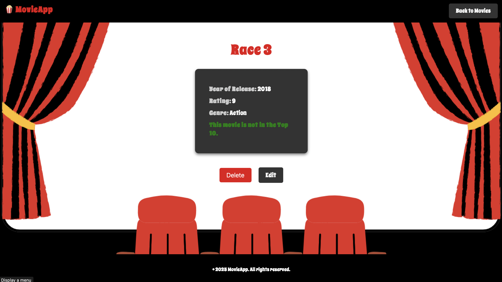

# MovieApp

>The MovieApp is a web application for managing your personal movie collection. This project allows users to add, edit, view, and delete movies from their personal list. It is built with Express.js, connected to a MongoDB database, and supports user authentication with sessions.

## Getting Started
## Planning Materials 
[View Planning Document](https://docs.google.com/document/d/1OFcqyYHjfDCbweLAzu08CJ1Ypt_gQd6PVebieOp8sN0/edit?usp=sharing)

## Attributuions 

- [Backgrounds](https://www.canva.com)
- [Font](https://fonts.google.com/specimen/Spicy+Rice)

## Technologies Used

## How the Website Works 
> The process begins with a landing page where users can either sign in or sign up. If the user clicks any other button, they will be redirected to the sign-in page.

> To sign up, users only need to provide a username, password, and confirm their password.

> If the user enters incorrect sign-in information, they will be redirected to an error page with message.

> Next is the sign-in page, where the user must enter a valid username and password that match the records in the database.

> Once the user signs in, the navigation bar will display a welcome message along with the username.

> Once signed in, users can view only the movies they have previously added.

> If the user clicks "Add New Movie," they will be redirected to a form page where they can fill in movie details. After submitting, the movie will be added to their list of favorite movies.

> If the user selects "View Details," they will be shown additional information on the movie's show page. From there, they can choose to either edit, delete, or go back to the movie list.

> Clicking "Edit" allows users to modify the movie's information and save the updates.

> If "Delete" is clicked, the selected movie will be removed.

> Clicking "Logout" will log the user out and redirect them to the home page.

## Features
- User registration and login with session handling
- Users can update movie information
- Users can delete movie entries
- Users can view all their own added movies
- Users can seamlessly navigate between pages
- Users can only view their own movies, not those of other users.

## Future Work

- Edit Profile for users to add more personal details
- Add new feature to the users to view other users movies